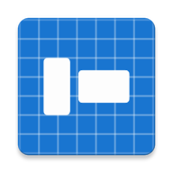

<div align="center">
  
  <h1>Aspect Ratio Calculator</h1>
  <p>An Android utility for calculating image and display dimensions.</p>

  <a href="https://play.google.com/store/apps/details?id=com.dimitriskatsikas.ratiocalculator">
    
  </a>
</div>

## 🛠 Technical Stack

- **UI Framework:** Jetpack Compose for a fully declarative UI.
- **Language:** Kotlin with Coroutines and Flows.
- **Dependency Injection:** Hilt for robust, testable dependency management.
- **Architecture:** MVVM (Model-View-ViewModel)
- **Navigation:** AndroidX Navigation 3 with type-safe route definitions for state-driven navigation.
- **Build System:** Gradle (Kotlin DSL) with custom **Convention Plugins** for centralized build logic.

## 🏗 Project Structure

The project follows a modular, feature-based architecture to promote scalability and maintainability:

```text
├── app/                  # Application entry point & Hilt setup
├── build-logic/          # Custom Gradle Plugins (Convention Plugins)
├── core/                 # Shared foundation modules
│   ├── common/           # Generic utilities & extensions
│   ├── designsystem/     # Design tokens, themes, and reusable UI components
│   └── navigation/       # Global navigation definitions
└── feature/              # Functional modules (Feature-on-Feature isolation)
    ├── calculator/       # Core math logic and calculation UI
    └── info/             # Informational/About screens
```

## 🚀 Key Engineering Highlights

- **Multi-Module Architecture:** Separation of concerns across `app`, `feature`, and `core` modules for better scalability and faster build times.
- **Unidirectional Data Flow (UDF):** Clean state management using `StateFlow` for UI state and `Channels` for one-time side effects (navigation, alerts).
- **Convention Plugins:** Centralized build configuration using custom Gradle plugins in `build-logic`, ensuring consistency and reducing boilerplate.
- **Unit Testing:** Comprehensive test coverage for domain logic and ViewModels to ensure reliability and facilitate safe refactoring.
- **E2E Testing with AI:** Utilizes **Google Journeys** for natural language, AI-driven End-to-End testing, allowing robust UI validation without maintaining brittle automation code.
- **CI/CD & Automated Maintenance:** Configured with GitHub Actions for continuous integration, alongside Dependabot (with dependency grouping) to ensure libraries like Compose, Kotlin, and Hilt remain secure and up-to-date.

## 🤖 AI Agent Ready

This repository is explicitly optimized for AI-assisted development. It utilizes a "Single Source of Truth" architecture for LLM guidelines, ensuring that AI coding assistants — including **Claude Code** and **Google Antigravity** (CLI, IDE, and Standalone) — automatically adhere to strict project conventions without hallucinating architectures.

- **Centralized Rules:** All architectural constraints, tech stack mandates, and security rules are maintained in `AGENTS.md`.
- **Tool-Agnostic Routing:** Contains native config files (like `CLAUDE.md` for Claude Code) that automatically point the respective AI assistants to the central guidelines.
- **Custom Agent Skills:** Includes a `.agents/skills` directory providing operational scripts and context specifically tailored for LLM agents working within this codebase:
    - [android-cli](.agents/skills/android-cli/SKILL.md): Orchestrates Android development tasks including project creation, deployment, SDK management, and environment diagnostics using the `android` command-line tool. For agents to fully utilize this skill, the host machine should have the `android` CLI tool installed.
    - [audit-documentation](.agents/skills/audit-documentation/SKILL.md): Audits, updates, and maintains all project documentation (README.md, AGENTS.md guidelines, and SKILL.md files).
    - [scaffold-feature](.agents/skills/scaffold-feature/SKILL.md): Generates a new Android feature module under the feature/ directory following the MVVM, Jetpack Compose, and Hilt architecture guidelines.
    - [validate-architecture](.agents/skills/validate-architecture/SKILL.md): Analyzes project code to ensure compliance with the Aspect Ratio Calculator architecture guidelines (MVVM, UDF, Jetpack Compose, Hilt, modularity).
- **Subagent Personas:** Includes a `.agents/agents` directory defining specialized subagent personas that can be adopted or invoked for specific workflows:
    - [CODE_REVIEWER_AGENT](.agents/agents/CODE_REVIEWER_AGENT.md): Persona for performing automated code quality, compose best practices, and architectural compliance reviews.
    - [GRADLE_UPDATE_AGENT](.agents/agents/GRADLE_UPDATE_AGENT.md): Persona for monitoring dependencies, catalog updates, and build modularity.
    - [UI_QA_AGENT](.agents/agents/UI_QA_AGENT.md): Persona for emulator management, journey tests, and visual regression testing.

## 🛠 Setup & AdMob Configuration

This project uses AdMob for advertisements. For security reasons, production AdMob IDs are not stored in the repository.

### For Local Development
The project is configured to use **official Google Test IDs** by default. You can clone and run the app immediately without any extra setup.

### For Production/Release Builds
If you want to build the release version with your own AdMob production keys, follow these steps:

1. Open (or create) the `local.properties` file in the root directory of the project.
2. Add your production keys as follows:
   ```properties
   # Admob keys
   ADMOB_APP_ID=ca-app-pub-xxxxxxxxxxxxxxxx~xxxxxxxxxx
   BANNER_AD_UNIT_ID=ca-app-pub-xxxxxxxxxxxxxxxx/xxxxxxxxxx
   ```
